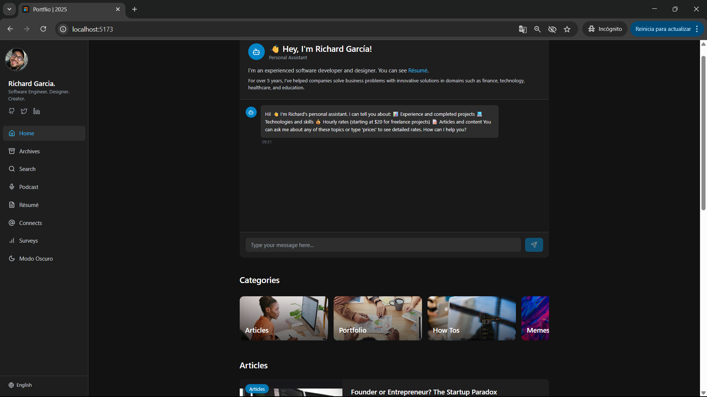

# Portafolio Profesional de Richard Garcia | 2025


Este repositorio contiene el código fuente de mi portafolio profesional, una moderna y completa Single-Page Application (SPA) desarrollada para mostrar mi experiencia, proyectos y habilidades en el desarrollo web.

**Visita el sitio en producción:** [**richard-garcia.vercel.app**](https://richard-garcia.vercel.app/)

---

### Vista Previa



---

## 🚀 Sobre el Proyecto

Este no es solo un portafolio estático. Es una aplicación web dinámica y multifuncional diseñada para actuar como mi centro de operaciones digital. El objetivo principal es presentar mi perfil profesional de una manera interactiva y completa, demostrando mis capacidades en el desarrollo de aplicaciones web modernas, desde el frontend hasta la integración con servicios de backend y APIs de terceros.

### Funcionalidades Destacadas

*   **🧑‍💻 Perfil Profesional Dinámico**: Secciones interactivas para mostrar mi portafolio de trabajos, proyectos personales, artículos y currículum.
*   **🌐 Soporte Multi-idioma (i18n)**: La aplicación está disponible en Español e Inglés, utilizando `react-i18next` para una experiencia de usuario localizada.
*   **🎨 Tema Oscuro/Claro**: Selector de tema persistente para adaptarse a las preferencias del usuario.
*   **🤖 Asistente con IA**: Un chatbot personalizado, integrado con la API de OpenAI, capaz de responder preguntas sobre mi experiencia, habilidades y proyectos.
*   **📝 Formularios y Encuestas Dinámicas**: Múltiples formularios (suscripción a newsletter, sugerencias, contacto, CV) y encuestas interactivas, con los datos gestionados a través de **Supabase** y notificaciones por email con **EmailJS**.
*   **📊 Dashboard de Administración**: Un panel privado para visualizar los resultados de las encuestas enviadas por los usuarios.
*   **📱 Diseño 100% Responsive**: Interfaz moderna y totalmente adaptable a cualquier dispositivo, construida con Tailwind CSS.

---

## 🛠️ Tecnologías Utilizadas

Este proyecto fue construido utilizando un stack de tecnologías modernas, enfocadas en el rendimiento, la escalabilidad y una excelente experiencia de desarrollo.

*   **Framework Frontend:** [**React**](https://reactjs.org/)
*   **Bundler y Entorno de Desarrollo:** [**Vite**](https://vitejs.dev/)
*   **Lenguaje:** [**TypeScript**](https://www.typescriptlang.org/)
*   **Estilos CSS:** [**Tailwind CSS**](https://tailwindcss.com/)
*   **Routing:** [**React Router**](https://reactrouter.com/)
*   **Backend como Servicio (BaaS):** [**Supabase**](https://supabase.io/) para la base de datos y autenticación.
*   **Integraciones de API:**
    *   [**OpenAI**](https://openai.com/) para el chatbot.
    *   [**EmailJS**](https://www.emailjs.com/) para el envío de correos desde el cliente.
*   **Animaciones:** [**Framer Motion**](https://www.framer.com/motion/)
*   **Gestión de Formularios:** Componentes controlados de React.
*   **Despliegue:** [**Vercel**](https://vercel.com/)

---

## ⚙️ Cómo Poner en Marcha el Proyecto Localmente

Si deseas ejecutar este proyecto en tu propia máquina, sigue estos pasos:

1.  **Clona el repositorio:**
    ```bash
    git clone https://github.com/riche45/Professional-Landing.git
    cd Professional-Landing
    ```

2.  **Instala las dependencias:**
    ```bash
    npm install
    ```

3.  **Configura las variables de entorno:**
    *   Crea un archivo `.env` en la raíz del proyecto.
    *   Copia el contenido de `.env.example` (si existe) o añade las siguientes variables con tus propias claves:
      ```
      VITE_OPENAI_API_KEY=...
      VITE_EMAILJS_SERVICE_ID=...
      VITE_EMAILJS_TEMPLATE_ID=...
      VITE_EMAILJS_TEMPLATE_ID_2=...
      VITE_EMAILJS_PUBLIC_KEY=...
      VITE_SUPABASE_URL=...
      VITE_SUPABASE_ANON_KEY=...
      ```

4.  **Ejecuta la aplicación:**
    ```bash
    npm run dev
    ```
    La aplicación debería estar disponible en `http://localhost:5173`.

---

## 📫 Contacto

*   **LinkedIn:** [Richard Garcia](https://www.linkedin.com/in/richard-garcia-vizcaino/)
*   **Email:** `richardlisongarcia@gmail.com` 